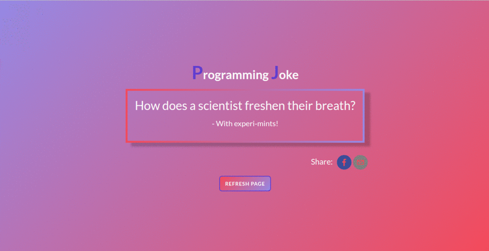

# RANDOM-JOKE
## [ Check out the deployed version here!](https://sushmitha-randomjoke.netlify.com)
## Project Details

This is the simple and responsive web-application that shows random joke setup and its punchline(after few seconds). It also allows you to share the joke on Facebook and Gmail.(completed in 1-day)

## Table of contents:

- **[Technologies used](#technologies-used)**
- **[Goals for this project](#goals-for-this-project)**
- **[Gif of the Random-Joke](#Gif-of-the-Random-Joke)**

## Technologies used

- **React**
- **Redux**
- **Redux-Thunk**
- **React-share**
- **[Joke API](https://github.com/15Dkatz/official_joke_api)**

## Goals for this project:

- To practice React and Redux
- To learn styling using SASS/SCSS
- Git usage
- Integrate with external API's

## Gif of the Random-Joke

